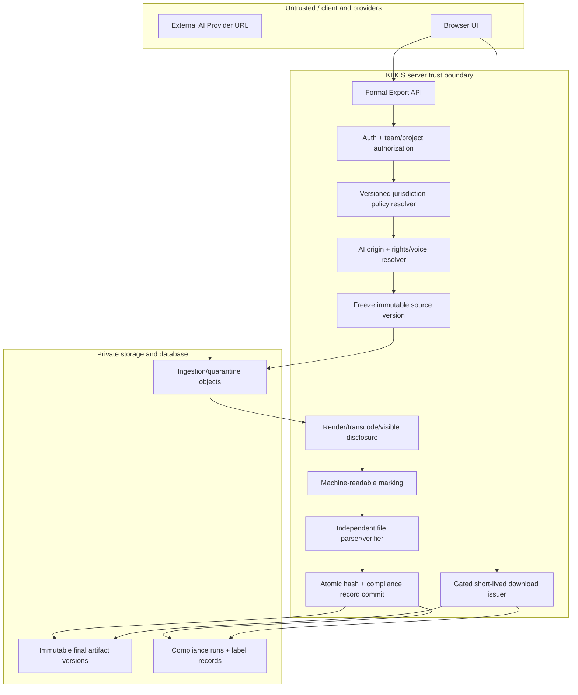

# Gate 0A Review Summary

**任务卡：** `KIIKIS-CX-G0-001`

**审查基线：** `4d3366b441cc0b8a9a6a966eaf52e7797d3a1b6d`

**审查日期：** 2026-07-17

**范围：** Gate 0A 双法域 AI 标识实施前架构与缺口审查；不含 Gate 0B，不含 Gate 1–5。
**基线说明：** 审查期间 `main` 已前进到 `3af9230`，但本报告的代码证据和行号严格来自任务指定基线 `4d3366b`。审查期间工作区内的未提交 `package.json`、`pnpm-lock.yaml` 以及任何在途 migration/E2E 均未作为既有能力计入。

结论：**PASS WITH MUST-FIX**

Kimi 可以按本报告修订后的 ADR、Schema 和接口边界开始实施；但 `4d3366b` 不能进行任何 EU/CN 正式发布导出。当前基线没有 Compliance Export Gate、机器标识 writer、最终文件 verifier、法域规则、服务端严格模式或合规记录；文本/字幕/制作包大量在浏览器直接生成 Blob，图片与视频又存在 Provider/CDN URL 直达路径，任何前端开关都无法形成 fail-closed。

生产放行条件不是“数据库写入成功”，而是：**最终字节已完成所有转码和可见披露 → 机器标识写入 → 独立解析验证 → 最终文件 hash 与合规记录原子绑定 → 只通过受控下载端点签发短期 URL**。

风险级别统一使用：`BLOCKER`、`MUST FIX`、`SHOULD FIX`、`INFORMATIONAL`。

---

## 1. Existing Export Surface Inventory

### 1.1 导出与下载矩阵

| 内容类型 | 页面/API | 文件路径与行号（基线） | 当前输出方式 | 当前机器元数据 | 可绕过未来 Gate | 风险 |
|---|---|---|---|---|---|---|
| Markdown / DOCX / ZIP | 新创作工作台导出页 | `components/creation/CreationWorkbench.tsx:761-762`；`lib/creation/downloads.ts:23-45,48-74` | 浏览器内构建 DOCX/ZIP，`Blob` + 临时 URL 直接下载 | DOCX 仅写 `creator/title/description`；MD/ZIP 无 AI 标识；ZIP manifest 无文件 hash | 是，100% 客户端 | `BLOCKER` |
| Markdown / Word `.doc` / PDF | 旧项目工作台 | `app/projects/[projectId]/page.tsx:1250-1300,1919-1921,2140-2163` | MD/HTML `.doc` 走浏览器 Blob；PDF 走新窗口 `print()` | 无 AI 标识；浏览器打印 PDF 无可控 verifier | 是 | `BLOCKER` |
| Universe JSON / MD | Universe 详情 | `app/universes/[universeId]/page.tsx:316-320,375-376,1034-1043` | 浏览器 Blob | 无 | 是 | `BLOCKER` |
| Production MD / JSON / SRT / CSV | Production Workbench、Archive | `components/production/ProductionWorkbench.tsx:452-458`；`app/archive/page.tsx:219-222`；`components/production/ExportMenu.tsx:20-38` | 浏览器 Blob | 无；SRT 是裸文本 | 是 | `BLOCKER` |
| SRT | Production ExportMenu | `lib/production/state.ts:585-612,665-677` | 裸 `.srt` Blob | 无同名 manifest，无主文件 hash | 是 | `BLOCKER` |
| EDL / FCPXML | Assembly / Production | `components/production/AutoAssemblyPanel.tsx:87-106`；`lib/production/state.ts:760-810` | 浏览器 Blob | 无；文件内直接嵌入 Provider/素材 URL | 是 | `BLOCKER` |
| Viral 分析 Markdown | Viral Workbench | `app/viral-workbench/page.tsx:568-570,824-831` | 浏览器 Blob | 无 | 是 | `MUST FIX` |
| Archive manifest JSON | Archive History | `app/archive-history/page.tsx:240-248` | 将数据库 manifest 重新序列化后浏览器下载 | 不是最终文件标识；不绑定下载文件 | 是 | `MUST FIX` |
| Project JSON / Markdown API | `POST /api/exports` | `app/api/exports/route.ts:6-17`；`lib/supabase/phase2.ts:534-585` | API 直接返回 JSON/字符串，并先写 `storyflow_exports` 为 `completed` | 无最终文件、无最终 hash、无 verifier | 是，API 可直接调用 | `BLOCKER` |
| 图片资产 | Art Asset Detail | `components/art/ArtAssetDetail.tsx:187-191` | `<a href={imageUrl} download>` 直连已存 URL | 无标识验证 | 是 | `BLOCKER` |
| Art AI 图片 | Art generate API | `app/api/art/generate-image/route.ts:27-53`；`lib/supabase/art-storage.ts:16-33,36-62` | Provider 图片拉回 Supabase 后返回 7 天 signed preview URL | 不写 AI 元数据；不计算输出 hash | signed URL 可复制、下载端点不复核 | `BLOCKER` |
| Production Shot 图片 | Shot generate API / Production UI | `app/api/production/generate-shot-image/route.ts:58-88`；`components/production/ProductionWorkbench.tsx:755-795` | Provider URL 原样写入 shot 并在 `` 展示 | 仅 provider/model 在响应；文件未入 KIIKIS 受控存储 | 是，右键/直链即可取文件 | `BLOCKER` |
| Production / Video 视频 | Video status / Video Workbench | `app/api/production/video-status/route.ts:81-145`；`app/video-workbench/page.tsx:625-652,876-877` | Provider `download_url` 原样写入 DB、返回浏览器并给 `<video controls>` | 无 KIIKIS 文件版本、hash、标识或复核 | 是，Provider URL 是旁路 | `BLOCKER` |
| 通用图片/视频/音频结果 | Job Center | `app/api/production/jobs/route.ts:199-239`；`app/job-center/page.tsx:297-305` | 登录用户可更新自己的 job `result_url`，UI 直接打开该 URL | `result_metadata` 自由 JSON；无可信来源或 compliance 状态 | 是，用户可把任意 URL 标为完成结果 | `BLOCKER` |
| 历史 archive URL | Archive 页面 | `app/archive/page.tsx:159-180,259-267` | 读取 URL 后直接打开 | 无下载时复核 | 是；且页面对 `/api/exports` 发 GET，但基线路由只有 POST | `MUST FIX` |
| Storyboard / Video “导出 JSON” | 两个旧工作台 | `app/storyboard-workbench/page.tsx:746-749,1150-1153`；`app/video-workbench/page.tsx:394-396,819-822` | 只 `console.log`，并未下载文件 | 不适用 | 当前不是有效导出，但 UI 会误导 | `SHOULD FIX` |
| 音频 / 音乐 | Song Workbench、通用 Job | `app/song-workbench/page.tsx:72-110`；`supabase/migrations/20260716180000_unified_generation_jobs.sql:5-38` | 基线无专用音频生成/正式下载；通用 job 可存任意 `result_url` | 无 synthetic voice、授权引用或文件 hash | 一旦 audio job 接入 Job Center 即自动形成旁路 | `BLOCKER（上线音频前）` |

### 1.2 当前文件处理链

```text
Art 路径 A（相对完整但仍未标识）
Provider URL → KIIKIS 服务端 fetch → Supabase private object → 7 天 signed preview URL → 浏览器直接下载

Shot 图片路径 B（旁路）
Provider URL → shot.image_url → 浏览器  / 右键下载

视频路径（旁路）
Provider file_id → Provider download_url → shot.video_url / job.result_url → 浏览器 <video> / 直链

文本、字幕、制作包
浏览器内存状态 → Blob/print() → 本地文件
```

基线没有 FFmpeg、ffprobe、C2PA、XMP/EXIF/ID3/BWF/iXML、PDF metadata writer 或机器标识 verifier；`supabase/migrations/20260717000000_create_art_assets_bucket.sql` 在该基线是 0 字节文件。

**最可靠写入点：** 所有渲染、转码、裁剪、字幕烧录、混音、可见水印/片尾完成后的“最终 artifact staging”阶段。机器标识必须在最后一次改变媒体字节之后写入并立即验证。任何后续媒体处理都必须生成新的 asset version，并重新标识、重新验证、重新 hash。

---

## 2. Existing Metadata and AI-Origin Capabilities

### 2.1 可复用能力

| 能力 | 证据 | 复用判断 |
|---|---|---|
| Provider / model / provider task ID | `storyflow_art_asset_versions`：`supabase/migrations/20260716000000_baseline.sql:171-187` | 可作为来源证据，但字段是自由文本，需映射到稳定 `provider_code`；缺 `model_version` |
| 统一 generation job | `supabase/migrations/20260716180000_unified_generation_jobs.sql:5-38` | 可作为 origin 输入；缺 idempotency、input manifest hash、output asset version/hash，且 `result_url` 不是可信最终资产 |
| Text generation task snapshot | `supabase/migrations/20260716000000_baseline.sql:543-592` | 可用于内部 provenance；不可把完整 prompt/snapshot复制到公开文件元数据 |
| Art asset version | `supabase/migrations/20260716000000_baseline.sql:171-187` | 可复用其版本身份；只有 art 域存在，video/audio/text 缺统一 immutable asset version |
| Model registry | `supabase/migrations/20260716230000_model_registry.sql:4-20` | 可作为用户可选模型目录；不是全局、稳定、不可碰撞的 provider code registry |
| Input asset hash | `supabase/migrations/20260717010000_v4_core_tables.sql:421-428` | 可作为输入冻结证据；不能替代最终输出 hash |
| Export archive sha256 | `supabase/migrations/20260717010000_v4_core_tables.sql:372-384` | 可借鉴字段；当前前端实际只 hash manifest，且用前缀模糊比较，不验证 `storage_path` 文件：`app/archive-history/page.tsx:197-225` |
| Team/project 字段 | `storyflow_assets` 有 `project_id/team_id`：`supabase/migrations/20260716000000_baseline.sql:337-347` | 可复用命名，但各表 scope 不一致；合规表必须同时具备并校验 team/project |

### 2.2 必须新建或补齐

- `ai_generated` 与 `ai_modified`：必须是显式三态/四态来源判定，不能把缺值当 `false`；建议 `origin_class = HUMAN | AI_GENERATED | AI_MODIFIED | UNKNOWN`，正式导出时 `UNKNOWN` fail closed。
- 稳定 `provider_code`：服务端管理、全局唯一、不可由用户自由填写；与现有 provider/model 自由文本做映射。
- `model_version`：模型别名和实际版本分开；无法获得时保存 `unknown` 并按规则决定是否阻断，而不是伪造版本。
- 稳定 `content_id`：服务端生成 UUIDv7/ULID，数据库唯一；同一 export request 的重试复用，规则升级重标识生成子版本并保留 lineage。
- `final_output_sha256`：对最终可下载字节计算；不能复用 source hash、manifest hash 或 Provider ETag。
- immutable final asset version：video/audio/document/text export 均需有版本实体；Provider URL 只允许作为 ingestion source。
- `rule_version`、`adapter_version`、verification tool/version、sidecar subject hash、最终 MIME 和文件大小。
- `preview` 与 `formal_export` 明确分类；“可在 UI 预览”绝不推导出“可下载/发布”。

### 2.3 敏感信息边界

`lib/supabase/phase2.ts:571-585` 当前把完整 export payload 同时写入 `payload_json` 和 `metadata`。这类内部记录可以保留在受限数据库中，但绝不能直接复用为公开文件 metadata。公开 metadata 必须采用固定 allowlist，只允许最小字段，例如：AI 属性、稳定 provider code、content ID、法域 profile、规则/manifest hash、生成时间；禁止 prompt、用户邮箱、用户 ID、内部路径、signed URL、授权文件内容、API endpoint、错误堆栈和 verification 临时目录。

---

## 3. Bypass and Fail-Open Risks

### B-01｜`BLOCKER`｜客户端 Blob/print 导出绕过任何服务端 Gate

- **文件路径/行号：** `lib/creation/downloads.ts:48-74`；`components/production/ExportMenu.tsx:30-38`；`app/projects/[projectId]/page.tsx:1250-1294`；`app/universes/[universeId]/page.tsx:1034-1043`。
- **风险：** 前端 Feature Flag、按钮禁用或 UI badge 都不能阻止用户调用现有函数、旧 bundle 或 API 直接获取未标识内容。
- **失败场景：** Gate 新 UI 已上线，但旧页面、缓存 JS 或直接函数入口继续生成未标识 MD/SRT/PDF/ZIP。
- **最小修复：** 所有正式导出改为调用同一服务端 `create formal export` API；客户端只接收 export ID/status，最终通过 gated download endpoint 获取文件。旧 Blob 函数仅可用于明确标记的 `INTERNAL_ONLY` 临时预览，且不得展示“正式导出”。
- **处理：** Kimi；TRAE 负责清理/禁用旧 UI 入口及 E2E。

### B-02｜`BLOCKER`｜Provider URL、signed URL 和任意 job result URL 是下载旁路

- **文件路径/行号：** `app/api/production/video-status/route.ts:81-145`；`app/api/production/generate-shot-image/route.ts:73-88`；`components/art/ArtAssetDetail.tsx:187-191`；`app/job-center/page.tsx:297-305`。
- **风险：** 文件从未进入最终 artifact staging，无法重标识、验证、hash 或撤销下载；Provider URL 还可能过期或内容可变。
- **失败场景：** 合规 Gate 阻断正式导出，但用户从 `<video controls>`、``、Job Center 或复制 URL 下载原始 Provider 文件。
- **最小修复：** Provider URL 只能进入 server-side ingestion；浏览器只获得 KIIKIS preview token。正式下载必须引用 `verified label_record_id`。对旧 URL 页面在 Gate 开启时隐藏/代理下载并显示 `INTERNAL_ONLY`。
- **处理：** Kimi；TRAE 做 UI/E2E。

### B-03｜`BLOCKER`｜导出数据库状态与真实文件成功状态脱节

- **文件路径/行号：** `app/api/exports/route.ts:6-17`；`lib/supabase/phase2.ts:534-585`；`supabase/migrations/20260716000000_baseline.sql:523-535`。
- **风险：** API 在没有生成文件、写标识、验证或 hash 的情况下记录 `status='completed'`。
- **失败场景：** 产品/审计页面把一条数据库记录解释为“已标识/已合规”，实际只有未标识字符串响应。
- **最小修复：** 状态机至少区分 `requested → rendering → marking → verifying → verified → released`，任何 error 进入 `blocked/failed`；只有 `verified` 记录能签发正式下载。
- **处理：** Kimi。

### B-04｜`BLOCKER`｜未区分 Internal Preview 与 Formal Export

- **文件路径/行号：** `components/production/ProductionWorkbench.tsx:452-458,755-795`；`components/art/ArtAssetDetail.tsx:187-191`。
- **风险：** 同一 URL/按钮同时承担预览和下载语义，无法对正式发布应用更严格策略。
- **失败场景：** 标识失败后媒体仍可通过 preview URL 保存并外发。
- **最小修复：** 资产状态与 URL capability 分离；preview URL 短 TTL、仅 inline、不可作为 formal export；正式导出生成新 artifact version。
- **处理：** Kimi / TRAE。

### B-05｜`BLOCKER`｜通用 Job 更新接口允许客户端声明结果 URL 与完成状态

- **文件路径/行号：** `app/api/production/jobs/route.ts:199-239`，尤其 `:211-228`。
- **风险：** 登录用户可把其 job 的 `status/result_url/result_metadata` 更新为任意值。即使 owner scope 正确，也不能把该字段作为可信 AI origin 或合规放行依据。
- **失败场景：** 客户端把未标识外部文件 URL 写入 job 并标记 `completed`，随后 Job Center 直接打开。
- **最小修复：** Provider completion、result ingestion 和 compliance status 仅允许可信 worker/service 写；用户 API 只能请求 cancel 或确认，不得写 `completed/result_url`。
- **处理：** Kimi。

### B-06｜`BLOCKER`｜不存在统一服务端 Feature Flag/Policy Resolver

- **文件路径/行号：** 基线 `.env.example:85-91` 仅有 `NEXT_PUBLIC_UNIVERSE_*` 示例；`lib/universe.ts:235-249` 展示客户端可读 allowlist/dev unlock 模式。
- **风险：** 如果合规 flags 复制该模式，篡改客户端环境或调用旧 API 即可绕过；公开 email allowlist 还会泄露账号信息。
- **失败场景：** UI 显示 Gate 已开，但 API 未校验；或 flag 关闭后旧路径 fail open 并显示“已合规”。
- **最小修复：** 所有合规决策由服务端 Policy Resolver 计算；UI 只读取鉴权后的 resolved capability/status，不参与授权。
- **处理：** Kimi。

### B-07｜`BLOCKER`｜Sidecar 被当成无条件 fallback 会产生法域误判

- **依据：** 中国网信办说明下载/复制/导出文件应包含显式标识，文件元数据应含隐式标识；EU Article 50(2) 要求输出采用机器可读且可检测的标记。Sidecar 是否对某一格式满足“输出/文件元数据”要求，不能由工程团队自行假定。
- **失败场景：** 主文件与 sidecar 分离、重命名或错配；产品仍显示“已合规”。
- **最小修复：** Sidecar 仅是规则版本明确允许的 fallback；必须包含主文件 SHA-256、content ID、规则版本并签名/校验，默认以绑定 bundle 发放。CN/EU strict 下，未获标准映射或法律确认的裸 MD/SRT/TXT 正式导出 fail closed。
- **处理：** Kimi / Legal / 标准合规顾问。

### M-01｜`MUST FIX`｜现有 hash 校验不是最终文件校验

- **文件路径/行号：** `app/archive-history/page.tsx:197-225`。
- **风险：** 只 hash `manifest_json`，再以 12 字符前缀互相比较；无法证明 `storage_path` 文件与记录一致。
- **最小修复：** verifier 读取最终对象字节，计算完整 SHA-256 并做常量时间全值比较；manifest 和主文件分别 hash。
- **处理：** Kimi。

### M-02｜`MUST FIX`｜RLS 模式不能照搬现有 `USING (true)`

- **文件路径/行号：** `supabase/migrations/20260717010000_v4_core_tables.sql:97-115,415-437`。
- **风险：** 合规记录、verification 输出和内部 storage path 若使用公开策略，会跨 team/project 泄露。
- **最小修复：** team membership + project scope RLS；client 只读 sanitized view；run/record INSERT/UPDATE 限可信服务；禁止客户端 DELETE 成功记录。
- **处理：** Kimi / Codex Gate 0B 复审。

### M-03｜`MUST FIX`｜当前 CI 不运行测试

- **文件路径/行号：** `package.json:4-13` 没有 `test`；`.github/workflows/ci.yml:27-41` 只有 install、tsc、build、diff check。
- **风险：** writer/verifier/fail-closed 回归可在 main 上无测试通过。
- **最小修复：** Kimi 在实现提交中新增基于现有 `node:test` 的明确 scripts，并把 unit/integration/fixture verification 加入 CI；TRAE 的 Playwright E2E 另加 job。
- **处理：** Kimi / TRAE。

---

## 4. Proposed ADR Corrections

基线没有 `docs/adr/`。Kimi 实施前至少提交一份 ADR，建议标题：**“Gate 0 Formal Export Authority, Artifact Finalization and Jurisdiction Policy”**。

### 4.1 修订后的信任边界与流程



### 4.2 必须写入 ADR 的决定

1. **服务端唯一授权点：** 任何 formal export 都必须创建 export request；没有 `verified label_record_id` 不签发下载。
2. **顺序修正：** 目标架构中的 “Apply Machine-Readable Marking → Apply Visible Disclosure” 必须反转。水印、片尾、credits、字幕烧录、混音、裁剪、转码都会改变文件字节；应先完成全部渲染/可见披露，再写机器标识并验证。
3. **C2PA 不是唯一实现：** C2PA writer 是可插拔增强；每个格式必须有独立 metadata/manifest writer 与 verifier。C2PA 失败不等于自动允许 fallback，只有当前 rule version 允许且 fallback 验证通过才可放行。
4. **法域不是布尔值：** `EU_ART50`、`CN_AIGC`、`EU_CN_DUAL`、`INTERNAL_ONLY` 对应版本化规则；法域选择不能仅信任客户端传参，需结合 workspace 默认区域、预期发布地和服务实体策略。
5. **Unknown fail closed：** AI origin、法域、最终 MIME、权属/Voice 授权任何一项未知，strict formal export 阻断。
6. **Preview 与 export 分离：** Provider 原文件只能进入 quarantine/internal preview；正式 export 是新的 immutable artifact version。
7. **下载时再次授权：** 下载 endpoint 在每次签发 URL 时检查用户/team/project、record=`verified`、hash 绑定、flag/policy 状态；不能永久保存可公开 URL。
8. **原子性：** 文件写入对象存储成功但 DB 失败时不 release；DB run 成功但 final object 缺失时 verifier/下载均阻断。采用 staged object + transaction + promote/immutable key，失败对象由后台清理。
9. **重标识不覆盖：** 规则升级或转码产生新 asset/export version，用 `supersedes_label_record_id` 建 lineage；旧记录不可改写成“符合新规则”。
10. **元数据 allowlist：** public marker schema 固定且最小化；内部 verification report 与公开 manifest 分表/分字段。

### 4.3 最小格式策略（须由 verifier 和规则版本驱动）

| 格式 | 最小机器标识 | 可见披露 | 必须验证 | 备注 |
|---|---|---|---|---|
| PNG | 标准兼容 metadata chunk/XMP；可选 C2PA | 按规则水印/说明 | 实际解析 chunk/XMP，图片可解码，hash 一致 | 禁止只检查 DB |
| JPG | EXIF/XMP；可选 C2PA | 按规则水印/说明 | 实际解析 EXIF/XMP，图片可解码 | 转码后重写 |
| MP4 | 容器 metadata/manifest；可选 C2PA | 片尾/credits/水印（按规则） | `ffprobe` 或等价 parser，媒体可播放 | 可见披露先于机器标识 |
| MP3 | ID3 兼容字段 | 声音/说明（按规则） | ID3 parser + 音频解码 | synthetic voice 另需授权引用（内部记录） |
| WAV | BWF/iXML 或经标准确认的 metadata | 声音/说明（按规则） | WAV chunk parser + 音频解码 | 不得把内部 Voice Profile ID 公开化 |
| PDF | 文档 metadata/XMP + manifest hash | 制作说明页/页脚（按规则） | PDF 可打开、metadata 可解析、页数有效 | 浏览器 `print()` 不可作为正式路径 |
| MD/TXT/SRT | 结构化 inline disclosure + 强绑定 `.ai-manifest.json` bundle | 文本可见说明 | 主文件 hash、sidecar subject hash、schema/signature | EU/CN strict 是否接受 sidecar 必须由 Legal/标准映射确认；未确认则阻断裸文件 |
| ZIP | 先标识每个成员；ZIP manifest 列出所有成员 hash | 每个适用成员各自披露 | 解包、逐文件解析、manifest 全量 hash | 外层 ZIP manifest 不能替代成员标识 |

表中的具体 metadata key/位置是工程候选，不是法律结论；CN 实现必须映射到 `GB 45438-2025` 及配套文件格式指南，EU 实现应对照 Article 50 与 2026 Code of Practice/最终指南。

---

## 5. Schema Corrections

PRD 提议的五张表**作为领域名称集合基本合理，但单独不足以形成可发布链路**。最小方案是不再新建第二套 export root，而是把现有 `storyflow_exports` 升级为 formal export request/root，并让五张表围绕它工作。

### 5.1 `storyflow_exports`（复用并升级）

必须增加或规范：

- `team_id`, `project_id`, `requested_by`
- `export_kind = INTERNAL_PREVIEW | FORMAL_EXPORT`
- `content_kind`, `format`, `source_asset_id`, `source_asset_version_id`
- `jurisdiction_profile_id`, `rule_version_id`
- `idempotency_key`（team scope 内唯一）
- `content_id`（服务端生成、全局唯一、重试复用）
- `status = requested | rendering | marking | verifying | verified | blocked | failed | released`
- `released_label_record_id`
- `created_at`, `released_at`

现有 `export_type` check 只允许 markdown/json/docx/pdf（`supabase/migrations/20260716000000_baseline.sql:523-535`），必须显式迁移，覆盖 PNG/JPG/MP4/MP3/WAV/SRT/ZIP 等，不能靠自由字符串绕过。

### 5.2 `storyflow_compliance_profiles`

- scope：`team_id` 必填，`project_id` 可空；禁止只有 owner scope。
- `profile_code`, `jurisdictions[]`, `default_for_region`, `strict_mode`
- `machine_marking_required`, `visible_disclosure_policy`
- `active_rule_version_id`, `effective_from`, `effective_to`, `status`
- 版本升级新建记录，不原地篡改历史 profile snapshot。

### 5.3 `storyflow_jurisdiction_rules`

- `jurisdiction`, `rule_version`, `content_kind`, `mime_type/format`
- `machine_formats[]`, `visible_modes[]`, `sidecar_allowed`
- `strict_block`, `effective_from/to`, `source_reference`, `status`
- 唯一约束：`(jurisdiction, rule_version, content_kind, format)`。
- rule snapshot/hash 写入每次 run，防止后台改规则后历史记录失去可解释性。

### 5.4 `storyflow_provider_codes`

- `provider_code` 全局唯一、不可复用；`legal_name/display_name` 分离。
- provider/model alias mapping 可版本化；模型 API key、endpoint、邮箱、内部账号绝不能在此表公开字段中出现。
- 旧 provider 自由文本无法映射时 origin=`UNKNOWN`，strict export 阻断。

### 5.5 `storyflow_export_compliance_runs`（attempt 日志）

至少：

- `id`, `export_id`, `attempt_no`, `idempotency_key`, `retry_of_run_id`
- `team_id`, `project_id`, `source_asset_version_id`
- `jurisdiction_profile_id`, `rule_version_id`, `adapter_version`
- `status`, `error_code`, `error_detail_private`
- `started_at`, `completed_at`, `worker_id`, `tool_versions_json`
- 唯一约束：`(export_id, attempt_no)` 与 `idempotency_key`。

重试创建新 run，不覆盖失败 run；同一 export request/content ID 重试，不重复生成收费事件。只有一个 verified run 可成为 `storyflow_exports.released_label_record_id` 的来源。

### 5.6 `storyflow_ai_label_records`（不可变 artifact 事实）

PRD 字段之外必须补：

```text
team_id
project_id
run_id
artifact_role                 # primary | sidecar | package | disclosure
mime_type
file_size_bytes
storage_region
storage_object_version
final_output_sha256           # 最终可下载字节
sidecar_sha256
sidecar_subject_sha256        # 必须等于 primary final_output_sha256
rule_version_id
adapter_version
verification_tool_versions
verification_report_private
public_manifest_json          # allowlist 后的公开内容
parent_asset_version_id
supersedes_label_record_id
verified_at
```

约束：

- `content_id` 全局唯一或按 artifact lineage 唯一，服务端生成；Provider task ID 不能充当 content ID。
- `(export_id, artifact_role, final_output_sha256)` 唯一；成功记录 append-only。
- `status` 至少 `pending | verified | failed | superseded`；只有 `verified` 能被 export root 引用。
- `verification_json` 不应直接对客户端开放；拆为 private report 和 public sanitized manifest。
- 公开 manifest 禁止 prompt、邮箱、用户 ID、内部路径、signed URL、Voice 原始样本/embedding、授权文档正文。

### 5.7 父子版本、Sidecar 与规则升级

- 转码/裁剪/混音/字幕烧录：创建新 asset version，引用 `parent_asset_version_id`；旧 compliance record 不继承为新文件的合规证明。
- Sidecar：记录主文件完整 SHA-256、content ID、MIME、大小、规则版本；sidecar 自身也 hash。下载时 verifier 同时校验两者。
- 规则升级：创建新的 export/asset version 和 label record，用 `supersedes_label_record_id` 连接；保留旧文件/记录的历史状态，不能静默覆盖用户已发布文件。

### 5.8 RLS

- `SELECT`：team membership + project access；普通成员默认只读 public/sanitized view。
- `INSERT/UPDATE`：export request 可由用户发起；run、verification、label record 仅可信 worker/service 写。
- `DELETE`：成功合规记录禁止普通用户删除；撤回/失效通过状态和审计事件表达。
- 管理员读取 private verification report 必须有审计日志。

---

## 6. Feature Flag Decisions

### 6.1 权威位置

| Flag | 权威位置 | UI 镜像 | 决策 |
|---|---|---|---|
| `COMPLIANCE_EXPORT_GATE` | 服务端 | 只展示 resolved status | 总闸门；关闭时 formal export 不得回落到旧下载 |
| `EU_ART50_MACHINE_MARKING` | 服务端 | 可展示结果，不可授权 | EU 规则输入 |
| `EU_ART50_VISIBLE_DISCLOSURE` | 服务端 | 可展示 resolved mode | 具体是否/如何披露由 rule/profile 决定 |
| `EU_ART50_STRICT_EXPORT_BLOCK` | 服务端 | 只展示 blocked 原因 | 不能有 `NEXT_PUBLIC_*` 授权逻辑 |
| `CN_AIGC_MACHINE_MARKING` | 服务端 | 可展示结果 | CN 现行要求映射 |
| `CN_AIGC_VISIBLE_MARKING` | 服务端 | 可展示 resolved mode | 不能只在 UI badge 披露 |
| `CN_AIGC_STRICT_EXPORT_BLOCK` | 服务端 | 只展示 blocked 原因 | 标识/验证失败 fail closed |
| `DUAL_JURISDICTION_MARKING` | 服务端 | 可展示 profile | 合并规则取并集/更严格项，不是简单 OR 两个 boolean |
| `UNMARKED_EXPORT_EXCEPTION` | 服务端 + 高权限审批 | 仅显示不可用/审批状态 | Phase 0 固定 false；不得暴露普通用户开关 |
| `GDPR_REGION_ROUTING` | 服务端 | 只展示后端决策 | 若 marking worker 会跨区，未实现 routing 时对应 export 必须 blocked |

不建议为上述 flags 创建同名 `NEXT_PUBLIC_*`。UI 应调用鉴权后的 `/api/compliance/capabilities`（或随 export API 返回）获取 `enabled/blocked/reason/profile/ruleVersion`。若 48 小时内必须有静态 UI 开关，最多使用不具授权意义的 `NEXT_PUBLIC_COMPLIANCE_UI_ENABLED`，且服务端关闭/失败时 UI 必须显示“合规标识功能未启用，正式导出不可用”，不能显示“已合规”。

### 6.2 48 小时最小生产组合

```text
COMPLIANCE_EXPORT_GATE=true
EU_ART50_MACHINE_MARKING=true
EU_ART50_VISIBLE_DISCLOSURE=true        # 启用能力，具体模式由规则决定
EU_ART50_STRICT_EXPORT_BLOCK=true
CN_AIGC_MACHINE_MARKING=true
CN_AIGC_VISIBLE_MARKING=true
CN_AIGC_STRICT_EXPORT_BLOCK=true
DUAL_JURISDICTION_MARKING=true
UNMARKED_EXPORT_EXCEPTION=false
```

`GDPR_REGION_ROUTING` 只有在真实实现并测试后才能标为 true；在此之前，合规 worker 必须与源数据同区，或对需要跨区的 export fail closed，不能用 `false` 表示“忽略区域要求”。

### 6.3 强制时间

- CN 标识办法与 `GB 45438-2025` 已于 2025-09-01 实施：对确认在范围内的 CN 正式导出，CN machine/visible/strict 现在就应开启。
- EU Article 50(2)/(4) 从 2026-08-02 适用：`COMPLIANCE_EXPORT_GATE`、EU machine、EU strict 最迟在该日前强制开启；visible capability 同期开启并按 deep fake/艺术创意规则解析。
- 不依赖未来过渡期提案；是否适用任何 grandfathering 由 Legal 明确，工程默认不放宽。

---

## 7. Required Test Entry Points

### 7.1 与当前仓库一致的测试接入

基线测试使用 Node 内置 `node:test`（例如 `tests/creation-assembly.test.mjs:1-10`），但 `package.json:4-13` 没有 test script，CI 也不运行测试。因此 Gate 0B 前 Kimi 必须：

1. 在 `package.json` 新增明确的 `test` 与 `test:compliance` scripts；脚本底层沿用 `node --test`，不要在报告中声称当前已有 `pnpm test`。
2. 新增 `tests/compliance/`，至少包含 policy unit、adapter format verification、export-gate integration、idempotency/retry 测试。
3. 把新增脚本加入 `.github/workflows/ci.yml`；固定 verifier 二进制/库版本并输出版本信息。
4. TRAE 的 Playwright E2E 独立接入；基线没有 Playwright 配置或 E2E job，不能以源码正则测试代替真实下载验证。

建议测试入口（文件名可调整，但职责不可合并掉）：

```text
tests/compliance/policy.test.mjs
tests/compliance/metadata-sanitization.test.mjs
tests/compliance/idempotency.test.mjs
tests/compliance/export-gate.integration.test.mjs
tests/compliance/formats/png.test.mjs
tests/compliance/formats/jpeg.test.mjs
tests/compliance/formats/mp4.test.mjs
tests/compliance/formats/audio.test.mjs
tests/compliance/formats/pdf.test.mjs
tests/compliance/formats/text-sidecar.test.mjs
tests/fixtures/compliance/*
```

### 7.2 格式验收矩阵

| 格式 | 文件可打开 | 实际解析机器标识 | DB/record | hash 绑定 | 后处理/失败路径 |
|---|---|---|---|---|---|
| PNG | 图片 decoder 成功 | 解析 metadata/C2PA，不检查字符串包含 | `verified` record | 完整 SHA-256 | 重编码后旧标识失效；重写成功后放行 |
| JPG | 图片 decoder 成功 | 解析 EXIF/XMP/C2PA | 同上 | 同上 | resize/recompress 后重新标识 |
| MP4 | `ffprobe` 或等价 parser 成功 | 解析 container/C2PA；验证可见披露模式 | 同上 | 同上 | 转码/烧字幕后重新标识；verifier 失败 403/blocked |
| MP3 或 WAV | 音频 parser/decoder 成功 | ID3 或 BWF/iXML/批准格式 | 同上 | 同上 | 混音后重新标识；synthetic voice policy |
| PDF | PDF parser 成功且页数有效 | 解析 document metadata/XMP | 同上 | 同上 | 加说明页后再标识；损坏 PDF 阻断 |
| SRT + sidecar | SRT 语法可解析 | sidecar schema + signature/hash | primary + sidecar records | subject hash 等于 SRT hash | sidecar 缺失/错配/重命名均阻断 |

每种格式都必须同时断言：

1. 机器标识实际存在且由独立 parser 读取；
2. 文件可正常打开/解码；
3. compliance run 与 label record 存在；
4. 最终文件完整 SHA-256 与记录一致；
5. 转码/裁剪/混音/烧字幕后旧验证失败，重新写入后才成功；
6. writer、verifier、DB commit、storage promote 任一步失败时 formal download 为阻断状态；
7. `INTERNAL_ONLY` preview 不产生 formal signed URL；
8. EU、CN、EU+CN 使用不同 rule snapshot，结果可解释；
9. public metadata/manifest 不含 prompt、email、user ID、内部路径、signed URL、secret；
10. 同一 idempotency key 重试返回同一 export/content ID，只产生一个 released record，且不重复写收费事件。

### 7.3 必测旁路

- 直接调用所有旧导出 API/页面函数，在 Gate=true 时必须被移除、代理或只允许 internal preview。
- 复制旧 Provider URL、过期 signed URL、替换 download URL、CDN 旧版本、sidecar 错配、缓存旧 bundle。
- 普通用户 PATCH generation job 为 `completed/result_url` 必须失败。
- Flag 关闭、Policy Resolver 超时、规则缺失、AI origin unknown、法域 unknown 均不得显示“已通过当前规则”。
- 验证 runner 必须读取导出文件，不允许只断言数据库 insert。

---

## 8. Blockers Before Kimi Implementation

以下是**开始编码前必须在 ADR/任务实现说明中接受的架构决定**；接受后可实施，不要求先完成整套代码。

### IMP-01｜`BLOCKER`｜确认服务端 Formal Export API 是唯一发布出口

- **风险：** 若保留客户端 Blob/Provider URL 为正式出口，后续 Adapter 无法覆盖全站。
- **最小修复：** ADR 列出第 1 节所有入口及迁移策略；旧入口默认 internal-only 或禁用。
- **处理：** Kimi，TRAE 确认 UI 清单。

### IMP-02｜`BLOCKER`｜确认顺序为 render/visible → machine mark → verify → hash/log → release

- **风险：** 原 PRD 顺序先 machine mark 后 visible disclosure，会让后处理破坏标识。
- **最小修复：** ADR 和接口状态机采用修订顺序。
- **处理：** Kimi。

### IMP-03｜`BLOCKER`｜确认 Sidecar 不是无条件法律 fallback

- **风险：** 对 CN 文件元数据要求或 EU machine-readable output 的适用解释错误。
- **最小修复：** 建立按 jurisdiction/content kind/format/version 的 fallback matrix；未批准组合 fail closed。
- **处理：** Kimi / Legal。

### IMP-04｜`BLOCKER`｜确认 export root、run attempt、label record 三层身份与幂等

- **风险：** 重试造成重复 content ID、冲突记录或多次放行。
- **最小修复：** 采用第 5 节 Schema 边界与唯一约束；重试新 run、同 export/content ID。
- **处理：** Kimi。

### IMP-05｜`BLOCKER`｜确认公开 metadata allowlist 与 private verification 分离

- **风险：** prompt、邮箱、内部路径、signed URL、Voice/权属信息泄露到公开文件。
- **最小修复：** ADR 固定 public schema；新增 sanitization tests。
- **处理：** Kimi / Legal。

---

## 9. Must Fix Before Production

1. `BLOCKER`：第 1 节所有真实下载/导出入口全部接入服务端 Gate，或在 Gate 开启时下线；不得保留旧 bundle/API 旁路。
2. `BLOCKER`：Provider 输出先进入 KIIKIS 私有 quarantine；正式文件不得直接引用 Provider/CDN URL。
3. `BLOCKER`：每个 formal artifact 有 immutable version、最终 SHA-256、content ID、rule version、adapter version和 verified label record。
4. `BLOCKER`：writer/verifier/storage/DB 任一步失败均 fail closed；只有 `verified` 可签发下载。
5. `BLOCKER`：客户端不能写 generation job 的可信完成状态/result URL/compliance 状态。
6. `BLOCKER`：PNG、JPG、MP4、MP3/WAV、PDF、SRT+sidecar 六类真实字节验收通过。
7. `MUST FIX`：EU/CN/dual/internal 四种 profile 独立、版本化；Flag 只在服务端授权。
8. `MUST FIX`：CN/EU strict 下 Sidecar 适用范围已有标准/Legal 结论；未确认格式保持 blocked。
9. `MUST FIX`：team/project RLS、生效的 service-only write policy、admin access log 已验证。
10. `MUST FIX`：CI 执行 unit + integration + real parser verification；TRAE staging E2E 保存下载文件、截图、network log 和 metadata dump。
11. `MUST FIX`：staging 演练旧缓存、URL 替换、CDN 旧对象、重试、DB/storage 部分失败、flag off。
12. `SHOULD FIX`：移除只 `console.log` 的伪“导出 JSON”按钮，避免验收误判。

---

## 10. Legal Assumptions Requiring Counsel

本节只列需确认的问题，不替代法律意见。

### 10.1 已核验的官方依据（截至 2026-07-17）

- EU Regulation 2024/1689 Article 50(2) 要求生成合成音频、图片、视频或文本的 AI system provider 确保输出具有机器可读、可检测标记，并要求技术方案在技术可行范围内有效、互操作、稳健、可靠；Article 50(4) 对 deep fake 披露及明显艺术/创意/虚构作品的适当披露作出区分：[EUR-Lex Regulation (EU) 2024/1689](https://eur-lex.europa.eu/legal-content/EN/ALL/?uri=CELEX%3A32024R1689)。
- 欧盟委员会说明 Article 50 相关义务从 2026-08-02 适用；2026 Code of Practice 是自愿但获认可的合规工具，不取代法规或指南：[European Commission — Code of Practice on Transparency of AI-Generated Content](https://digital-strategy.ec.europa.eu/en/policies/code-practice-ai-generated-content)。
- 中国网信办说明《标识办法》自 2025-09-01 实施，下载/复制/导出时应确保文件含所需显式标识，并在文件元数据中加入包含生成属性、服务提供者名称或编码、内容编号等制作要素的隐式标识；第九条无显式标识例外有协议和日志等条件：[中国网信办《人工智能生成合成内容标识办法》答记者问](https://www.cac.gov.cn/2025-03/14/c_1743654685896173.htm)。
- `GB 45438-2025` 是现行强制性国家标准，2025-09-01 实施：[全国标准信息公共服务平台](https://std.samr.gov.cn/gb/search/gbDetailed?id=301E0388CB75788DE06397BE0A0AE1B4)。

### 10.2 必须由 EU counsel 确认

1. KIIKIS 集成第三方模型并以自身产品提供生成能力时，在各链路分别属于 Article 50 的 provider、deployer，还是两者兼具。
2. 哪些编辑/本土化/格式转换属于 Article 50(2) 的 standard editing assistive function 或“未实质改变输入/语义”例外。
3. KIIKIS 的虚构角色、演员 likeness、声音克隆、剧情视频何时构成 deep fake；明显艺术/创意/虚构作品的“appropriate manner”应如何落地。
4. Sidecar-only 对 MD/SRT/TXT 是否满足 machine-readable output；ZIP bundle 是否足够。
5. 是否签署/采用 2026 Code of Practice，以及最终 Commission guidelines 对具体格式、检测、保留证据的影响。
6. 是否存在且是否选择依赖 grandfathering/transition；工程默认不依赖。

### 10.3 必须由中国大陆 counsel / 标准专家确认

1. KIIKIS 各服务形态是否落入《标识办法》适用的网络信息服务提供者范围，以及影视制作/文艺创作其他规定如何衔接。
2. `GB 45438-2025` 与各文件格式实践指南对 PNG/JPG/MP4/MP3/WAV/PDF/文本/SRT 的准确字段、位置、显式标识样式和 provider code 要求。
3. Sidecar 是否能替代“文件元数据中的隐式标识”；在得到肯定结论前，CN strict 禁止 bare sidecar-only 正式导出。
4. 第九条未添加显式标识输出的协议、责任提示、日志、用户声明和后续传播条件；Phase 0 维持 `UNMARKED_EXPORT_EXCEPTION=false`。
5. 艺术/虚构、企业内部制作、面向公众传播、跨平台再发布分别需要的显式标识形式。

---

## 11. Gate 0B Required Inputs

Gate 0B 必须另开任务卡 `KIIKIS-CX-G0-002`，不得把本报告当上线批准。至少提供：

```text
Base commit
Head commit
完整 commit range / diff
Gate 0 ADR 路径与最终状态
Migration/schema 路径与 rollback
Compliance Adapter 接口与实现路径
所有旧导出入口迁移清单
服务端 Feature Flag / Policy Resolver 路径
PNG/JPG/MP4/MP3或WAV/PDF/SRT+sidecar 测试入口
verifier 工具与版本
CI run URL / 结果
staging URL
TRAE E2E 截图、network log、下载文件、metadata dump
fail-closed 失败日志
RLS 测试结果
已获 Legal 确认的假设清单与仍待确认项
```

Gate 0B 审查重点：

1. 逐个复查第 1 节入口是否已接入/下线，特别是浏览器 Blob、Provider URL、Job Center、Archive direct URL。
2. 实际执行六类文件 verifier，不接受仅看 DB 或 mock 的测试。
3. 检查 machine marking 是否发生在所有转码/可见披露之后。
4. 检查 writer/verifier/storage/DB/flag/policy 任一失败均不能签发正式下载。
5. 检查 content ID、idempotency、重试、sidecar/main hash、父子版本、规则升级。
6. 检查 public metadata 无敏感字段，private verification 与 RLS 不泄露。
7. 确认 UI 不使用“100% 合规”等绝对文案；flag off 时明确正式导出不可用。

**Gate 0A 最终判断：** 可以按本报告开始实现；在 Gate 0B 对明确 commit range 给出上线结论前，EU/CN formal export 保持生产阻断。
